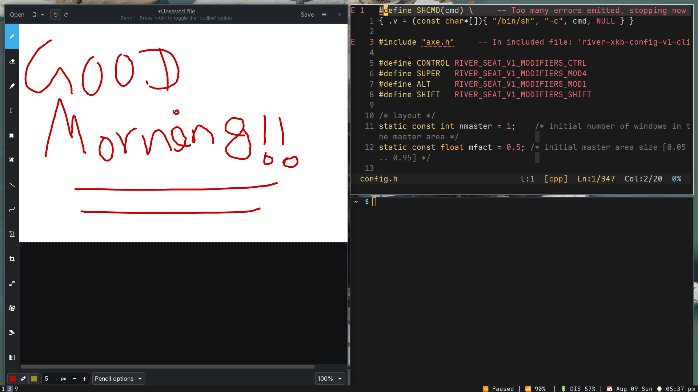

# Axe WM

A minimal [river](https://codeberg.org/river/river)-based window manager,
built against river's non-monolithic Wayland compositor architecture —
window-management policy (tiling, focus, tags) lives in this external
client process rather than in the compositor itself. river handles
compositing, rendering, and input; axe just tells it how windows should be
arranged and which one should be focused.

Heavily inspired by [dwm](https://dwm.suckless.org). Originally started
from changing stuff in [ANVL](https://git.auoggi.com/linux/anvl).

This is meant to be an opinionated window manager for my personal use —
mainly focused on window management features rather than eye candy like
animations and blur, other than whatever river itself already provides.



## Build Process

Requirements:

1. river 0.40+, specifically a build that implements the
   `river-window-management-v1` protocol — not guaranteed to be present in
   every packaged "0.40+", so check what your build of river actually
   supports before assuming a version number alone is enough.
2. A C compiler and `make`. The build uses `-std=c23`, so you'll need a
   recent-enough GCC or Clang — an older system compiler may not support
   it yet.
3. `wayland-client`, `wayland-cursor`, `xkbcommon`, `freetype2`, and
   `fontconfig` (all picked up via `pkg-config`), plus `wayland-scanner`
   at build time to generate protocol glue from the XML files in
   `protocol/`.

Everything else should already be present on a typical Linux system.

```sh
make clean build
```

## How to run

```sh
river -c pathToRepo/.build/axe
```

## Graphical login manager
 
river already ships its own `.desktop` file (usually somewhere like
`/usr/share/wayland-sessions/river.desktop`, depends on your distro).
Edit its `Exec=` line to `river -c /pathToaxeWM/.build/axe` and your login manager
will launch straight into axe. If your distro did not ship one with the river
package, then the `axe.desktop` file should look something like this.

```ini
[Desktop Entry]
Name=Axe
Comment=A minimal dwm-inspired window manager for river
Exec=river -c /pathToaxeWM/.build/axe
TryExec=river
Type=Application
DesktopNames=river
```

If you're on NixOS, I am not experienced with it. Look it up yourself.
 
## Configuration

Make changes to `config.h` and recompile. Keymaps and all the dials and
knobs are in there. Feel free to add features as needed by meddling with
the code itself — this isn't meant to be a general-purpose WM, so don't be
shy about bending it to what you personally want.

There is no runtime configuration, IPC, or config reload of any kind —
`config.h` compiles directly into the binary, dwm-style. That includes
theming: colors, fonts, gaps, and border widths are all just more entries
in `config.h`, not a separate runtime-loadable theme system. Change a
value, rebuild, restart axe.

## Features

- dwm-style master/stack layout.
- i3-inspired tabbed layout, toggleable per tag.
- Floating and fullscreen windows; cycle focus across the stack, and
  reorder windows within it (swap with the next/previous, zoom to
  master).
- Interactive move/resize of floating windows via mouse drag.
- Focus-follows-mouse, driven by real pointer motion.
- Sticky floating windows — always on top and visible on every tag at
  once, independent of the normal floating/tiled toggle.
- Multi-monitor support: tags, layout, and master/stack state are all
  independent per output, and windows can be moved between monitors with
  their floating geometry re-clamped to fit.
- Restart the window manager without killing the compositor — tag state,
  per-tag layout/master-stack settings, and window tag/floating geometry
  all survive the restart instead of getting reset.
- Per-tag focus memory: switching away from a tag and back returns you to
  whatever you actually had focused there, not always master or the first
  tab.
- From-scratch status bar rendered with FreeType — tag information on the
  left, a status command's output on the right — shown independently on
  every output.
- Smart borders (skipped for a solo window or in tabbed layout) plus
  configurable inner and outer gaps.
- Bar and tab strip autohide, independently togglable: show only while
  SUPER is held down, hide again on release.
- Per-device input configuration (mice, keyboards, touchpads, and other
  libinput devices).
- Autostart programs by listing commands in an array.
- Window rules matched by `app_id` and/or regex window title: force
  floating/tiled, set a default tag and monitor, set default floating
  geometry.
- Idle configuration: run arbitrary commands after a period of
  inactivity (with optional resume commands), plus automatic display
  power-off.
- Pointer cursor auto-hide after a period with no *mouse movement*
  specifically — keyboard-only activity doesn't count, unlike the idle
  timeouts above. Works by briefly taking cursor authority away from
  whatever window has it, so it doesn't need any cooperation from the
  application itself.
- Jump straight to a specific tab by number.
- Harpoon/nvHopper-inspired window marking: bookmark a window into one of
  5 fixed slots, then jump straight to it (focus + cursor warp) with a
  single keypress from anywhere. Slot count is currently fixed at 5;
  keybinds are configurable in `config.h`.
- Passthrough mode for games and virtual machines — disables every keybind
  except the one that toggles it back off.

I'd recommend going through the code, or at least `config.h`, to get a
feel for everything that's actually available.

## Acknowledgements

- [river](https://codeberg.org/river/river) — for building the
  non-monolithic architecture that makes this whole approach possible in
  the first place. axe wouldn't exist as itself without it.
- [dwm](https://dwm.suckless.org) — the primary inspiration, both for the
  master/stack tiling model and for the general "just read the source,
  `config.h` is the config" philosophy.
- [i3](https://i3wm.org) — inspiration for the tabbed layout.
- [AwesomeWM](https://awesomewm.org) — inspiration for some of the
  tagging ideas.
- [ANVL](https://git.auoggi.com/linux/anvl) — where this actually started,
  as changes on top of someone else's codebase before it grew into its
  own thing.
- [nvHopper](https://github.com/tiwari-krishna/nvHopper.nvim) — my own buffer-switcher for Neovim; the harpoon-style window
  marking here is a straight port of that same idea to windows instead of buffers.

## Contributing

This is primarily a personal, opinionated project — I'm building it for
how *I* want to work, not as a general-purpose window manager, so don't
expect every PR to land. That said, if you send something useful, I'll
genuinely consider merging it.

If axe doesn't fit what you want it to be, don't fight it — fork it and
make it your own instead. That's honestly the encouraged path over trying
to generalize this into something it was never meant to be.

## License

GPLv3 — see [LICENSE](LICENSE) for the full text. Short version: you're
free to use, modify, and redistribute this however you want, including
commercially — the one condition is that anything you build on top of it
and distribute has to stay open under the same license. Copyleft, not
just permissive.
